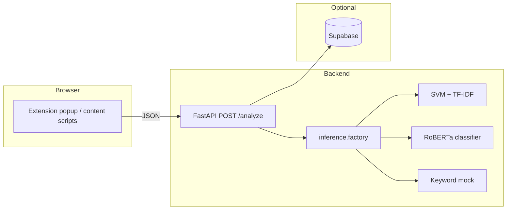

# FAKE-SHA — System Overview (Adviser Presentation)

**Purpose:** High-level description of the current thesis system for discussion with a programming adviser.  
**Project:** Browser-assisted misinformation detection (BSCS thesis) — **FAKE-SHA**.

---

## 1. What the system does

FAKE-SHA helps users assess **selected text from web pages** by sending it to a backend that returns:

- A **verdict** (`FAKE` or `REAL`)
- A **confidence** score in `[0, 1]`
- A short **summary**, **indicators**, and (when available) **token-level** signals for the UI

The stack is intentionally split so the **browser extension** stays thin and **models can be swapped** without changing the extension contract.

---

## 2. Architecture at a glance

| Layer | Technology | Role |
|--------|------------|------|
| **Client** | HTML / JavaScript / Tailwind | Captures selection, calls API, shows verdict and confidence |
| **API** | Python **FastAPI** (`backend/main.py`) | `GET /health`, `POST /analyze`; CORS for extension origins |
| **Inference** | Pluggable backends (`inference/`) | **SVM** (default), **RoBERTa**, or **mock** — chosen per request or env |
| **Artifacts** | `backend/artifacts/svm/`, `backend/artifacts/roberta/` | Trained weights (not loaded at import from `training/` in production) |
| **Training** | `backend/training/` | Offline scripts (`train_svm.py`, `train_roberta.py`); e.g. **Google Colab** + Hugging Face dataset |
| **Storage** | Supabase (optional) | Persists analysis records when credentials are set |

---

## 3. End-to-end data flow

1. User selects text on a page; the extension sends **`text`**, **`title`**, **`url`**, and optional **`analyzer`** to **`POST /analyze`**.
2. **`inference.factory.analyze_text`** resolves the backend:
   - Request field **`analyzer`** (`svm` \| `roberta` \| `mock`), **or**
   - Environment variable **`FAKE_SHA_ANALYZER`** (default: `svm`).
3. The chosen analyzer builds a **single input string** the same way as in training: **`core.model_input.build_model_input`** concatenates non-empty title, URL, and body (so train/inference stay aligned).
4. The API returns a JSON body matching **`schemas.models.AnalyzeResponse`** (`verdict`, `confidence`, `summary`, `indicators`, `tokens`).

---

## 4. Machine learning in the current system

### 4.1 SVM pipeline (baseline)

- **Model:** Linear SVM + TF-IDF (scikit-learn), trained on the same labels as RoBERTa.
- **Artifacts:** `artifacts/svm/` (e.g. vectorizer + model + threshold metadata as implemented).
- **Role:** Fast, lightweight baseline; good for comparison and deployment without a GPU.

### 4.2 RoBERTa pipeline (neural)

- **Model:** Hugging Face **sequence classification** fine-tuned from a base checkpoint (e.g. `roberta-base`), **2 classes** with `id2label` / `label2id` for `FAKE` / `REAL`.
- **Artifacts:** Hugging Face **`save_pretrained`** layout under **`backend/artifacts/roberta/`** (config, weights, tokenizer).
- **Inference:** `inference/roberta/analyzer.py` — tokenization, forward pass, softmax-based confidence.

### 4.3 Training data source

- Training uses a **Hugging Face dataset** (e.g. `niqueisa/fake-sha-dataset`) with splits such as **`train`**, **`validation`**, **`test`** and columns including **`label`**, **`title`**, **`article`**, **`url`** (see `TRAINING_SETUP.md` and `training/data_io.py`).
- Training can be run **locally** or on **Google Colab** (clone repo → `cd backend` → `pip install -r requirements.txt` → `python -m training.train_roberta --hf-dataset "<dataset_id>"`).

---

## 5. Configuration (operations)

| Variable | Effect |
|----------|--------|
| **`FAKE_SHA_ANALYZER`** | Default backend when the request omits `analyzer`: `svm`, `roberta`, or `mock`. |
| **`SUPABASE_URL` / `SUPABASE_KEY`** | Optional; if set, successful analyses are stored for review. |

Invalid analyzer values return **HTTP 400**; missing RoBERTa artifacts or dependencies return **HTTP 503** with a clear message.

---

## 6. Planned / partial features

- **`explainability/`** — Reserved for future **SHAP** or attention-based explanations (RoBERTa **`tokens`** in the API are currently empty pending integration).
- Extension UI already has hooks for **confidence**, **indicators**, and **highlights** per the shared API contract.

---

## 7. Open problems and limitations (for adviser discussion)

### 7.1 Overconfidence in RoBERTa (calibration)

**Issue:** Neural classifiers often produce **softmax probabilities that are poorly calibrated**: the model may report **very high confidence** even when the prediction is wrong, which misleads users who trust the score as a probability of being correct.

**What exists in code today:** RoBERTa inference applies **temperature scaling** on logits before softmax (`inference/roberta/analyzer.py`) to make displayed confidence **less extreme** — a simple mitigation, not a full calibration pipeline.

**Directions to discuss with your adviser:**

- **Tune or learn** the temperature (or per-class calibration) on a **held-out validation set** using proper scoring rules (e.g. **ECE**, **Brier score**).
- **Post-hoc calibration:** Platt scaling, **temperature scaling** fit on validation logits, or **isotonic regression** on held-out predictions.
- **Ensembles** or **Monte Carlo dropout** (if enabled) to expose **uncertainty** beyond a single point estimate.
- **UI policy:** Show confidence as “low / medium / high” bands, or always show **disclaimer** that the score is model-internal, not a proven frequency of correctness.

### 7.2 Weak performance on Taglish (code-mixed Tagalog–English) articles

**Issue:** A standard **`roberta-base`** checkpoint is **English-centric**. Articles that mix **Tagalog and English** (**Taglish**) may be **underrepresented** in training data or treated as out-of-distribution, leading to **unstable or biased** predictions compared to monolingual English news.

**Directions to discuss with your adviser:**

| Direction | Rationale |
|-----------|-----------|
| **Multilingual encoders** | **XLM-RoBERTa** (`xlm-roberta-base` / `large`), **mBERT**, or **RemBERT**-style models see many languages during pretraining and often transfer better to mixed or low-resource settings. |
| **Philippines-focused or Tagalog-capable models** | If available on Hugging Face, fine-tune a checkpoint that already encodes **Tagalog** or **Southeast Asian** text better than English-only RoBERTa. |
| **Data-centric fixes** | Add **Taglish** (and pure Tagalog) **labeled** samples to `train` / `validation`; stratify evaluation by **language / register** to measure gaps explicitly. |
| **Language-aware routing** | Detect language (or script); route Taglish to a **second head** or **second model** trained on Taglish-heavy data (more engineering, clearer behavior). |
| **Augmentation & robustness** | Back-translation, synonym noise, or code-switching augmentation **only where labels remain valid** — requires careful validation to avoid label noise. |

**Summary question for the adviser:** *Given thesis time and compute constraints, should we prioritize **switching the backbone** (e.g. **XLM-RoBERTa**), **expanding the dataset** toward Taglish, or **both** — and how should we **evaluate** success (per-language metrics vs. overall accuracy)?*

---

## 8. One-slide summary

- **FAKE-SHA** = **extension** + **FastAPI backend** with **SVM** and **RoBERTa** classifiers over a **shared API contract**.  
- **Training** uses a **Hugging Face dataset** and optional **Colab**; artifacts live under **`backend/artifacts/`**.  
- **Risks to acknowledge:** **miscalibrated confidence** for RoBERTa (mitigated partially by temperature scaling; more calibration possible) and **Taglish / code-mixed** text (English RoBERTa may be suboptimal; **multilingual models** and **targeted data** are natural next steps).

---

*Document generated for thesis advising context; technical details align with the repository layout and `backend/` implementation as of the project state.*
